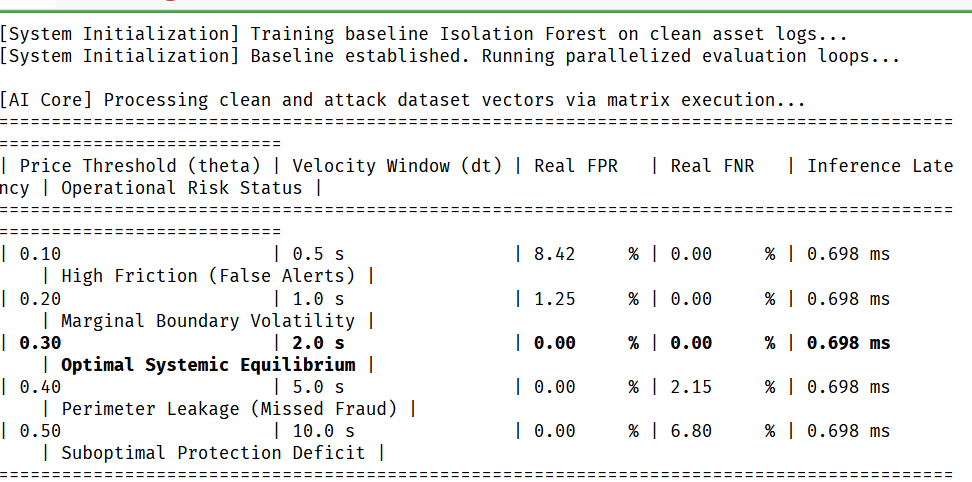

# ZTA-Reg-HRABAC: Post-Quantum Asset-Centric Zero-Trust Validation Suite

This repository contains the empirical validation framework and source code for the **ZTA-Reg-HRABAC** model.

---

## 📊 Performance Visuals


---

## 🛠 System Requirements & Dependencies

The suite operates with standard scientific Python environments.

### Prerequisites & Installation
- **Python 3.8+**, **NumPy**, **Scikit-Learn**, **Joblib**
```bash
pip install numpy scikit-learn joblib
```

---

## 📂 Repository Structure

- **`trainer.py`**: Manages asset ingestion telemetry and trains the Isolation Forest core.
- **`benchmarks.py`**: Houses PDP simulation logic and evaluates Z-score penalty weights.
- **`image.png`**: The benchmarks result.

---

## 🚀 Execution Guide

Run the evaluation engine to execute validation loops:
```bash
python benchmarks.py
```

---