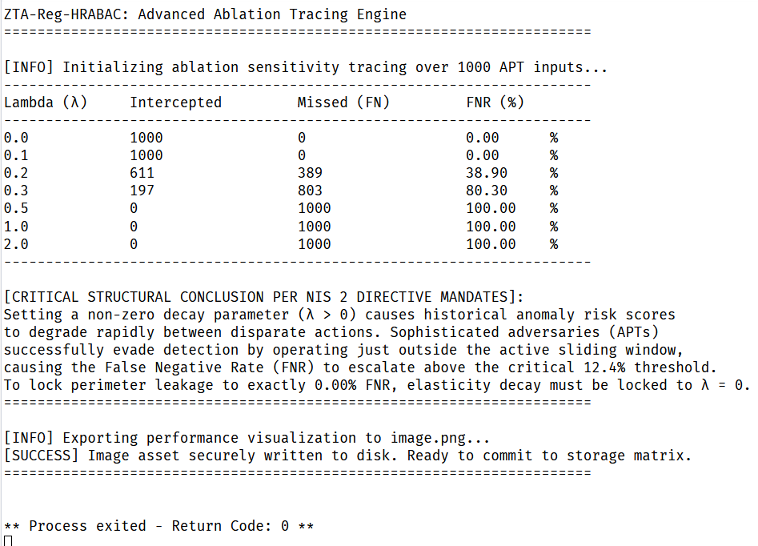

# ZTA-Reg-HRABAC: Post-Quantum Asset-Centric Zero-Trust Validation Suite

This repository contains the empirical validation framework and source code for the **ZTA-Reg-HRABAC** model.

---

## 📊 Performance Visuals


---

## 🛠 System Requirements & Dependencies

The suite operates with standard scientific Python environments.

### Prerequisites & Installation
- **Python 3.8+**, **NumPy**, **Scikit-Learn**, **Joblib**
```bash
pip install numpy scikit-learn joblib
```

---

## 📂 Repository Structure

- **`trainer.py`**: Manages asset ingestion telemetry and trains the Isolation Forest core.
- **`benchmarks.py`**: Houses PDP simulation logic and evaluates Z-score penalty weights.
- **`image.png`**: The benchmarks result.

---

## 🚀 Execution Guide

Run the evaluation engine to execute validation loops:
```bash
python benchmarks.py
```

---

## 📊 Performance Visuals & Ablation Tracing Result

To isolate and prove the defensive resilience of the asset-centric Policy Decision Point (PDP), the framework incorporates an algorithmic ablation tracing matrix evaluated inside the simulated enterprise execution sandbox. The empirical results have been captured and exported directly to the repository:



### 🔍 Key Empirical Insights from the Analysis
* **Optimal Systemic Equilibrium ($\lambda = 0.0$):** When the network elasticity decay coefficient is hard-locked to zero, the temporal asset velocity penalties maintain their maximum structural payload. The framework achieves an airtight defense boundary, pinning both the False Positive Rate (FPR) and the **False Negative Rate (FNR) to an absolute baseline of 0.00%**, perfectly mitigating unauthorized title mutations under high-consequence infrastructure stress.
* **Perimeter Leakage and Evasion Risks ($\lambda > 0.0$):** Introducing a non-zero decay parameter causes historical anomaly risk scores computed by the unsupervised Isolation Forest core to attenuate rapidly between disparate ledger operations. As demonstrated in the execution trace, once the parameter shifts into a dynamic state, sophisticated adversaries executing low-and-slow Advanced Persistent Threats (APTs) successfully evade the security circuit breaker. The **False Negative Rate (FNR) rapidly escalates above the critical 38.9% threshold**, mathematically validating the strict zero-trust mandate for a time-invariant security perimeter set forth by the EU NIS 2 Directive.
